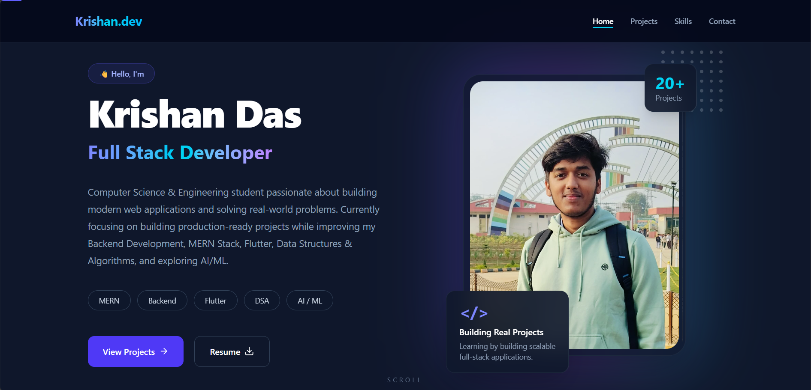
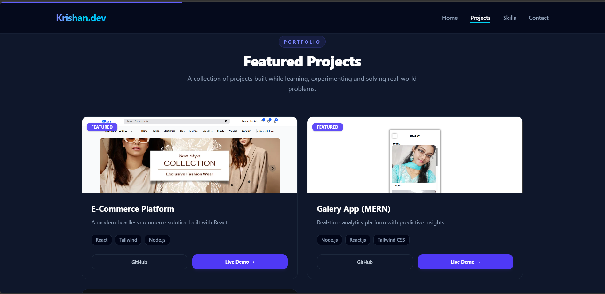

# 💼 Portfolio Website

A modern and professional portfolio website built with the MERN stack.

> **Current Status:** 🚧 Work in Progress

This repository currently contains the frontend design and the initial backend setup. The website is **not fully dynamic yet**. My goal is to gradually transform it into a complete full-stack portfolio with an admin dashboard for managing all content.

<!--
## 🚀 Live Demo

🌐 https://krishan-portfolio-rkora.netlify.app
-->
## 📸 Preview



---


---

## ✨ Features

### Frontend
- Modern and responsive UI
- Professional portfolio layout
- Hero section
- About section
- Skills section
- Projects section
- Contact section
- Smooth scrolling
- Mobile responsive design

### Backend
- Node.js + Express.js
- MongoDB
- JWT Authentication
- Refresh Token Authentication
- Secure Password Hashing
- Protected Routes
- Authentication APIs

---

## 🚧 Current Progress

### ✅ Completed

- Portfolio frontend
- Backend project setup
- Authentication system
- Login API
- Register API
- Refresh Token
- JWT Authentication
- Protected Routes
- Database connection

### 🚧 In Progress

The website is **currently static**.

At this stage:

- Portfolio content is still hardcoded.
- Admin dashboard authentication has been implemented.
- Dynamic content management is not completed yet.

The remaining admin panel features will be added in future updates.

---

## 📌 Planned Features

- Dynamic Portfolio
- Project Management
- Skills Management
- Experience Management
- Education Management
- Certificate Management
- Contact Message Management
- Profile Management
- Social Links Management
- Image Upload
- Resume Upload
- Dashboard Analytics
- Settings Management

---

## 🛠 Tech Stack

### Frontend

- React.js
- Tailwind CSS
- React Router

### Backend

- Node.js
- Express.js
- MongoDB
- Mongoose
- JWT
- bcrypt
- Cookie Parser

---

## 📂 Project Structure

```
Portfolio/
├──Admin/      # Admin dashboard (React)
├──Backend/    # Express.js API & MongoDB
└──Frontend/   # Portfolio website (React)


```

---

## ⚙️ Installation

### Clone Repository

```bash
git clone https://github.com/Krishan-Das/portfolio-website.git
```

### Install Dependencies

Admin

```bash
cd Admin
npm install
```

Backend

```bash
cd Backend
npm install
```

Frontend

```bash
cd Frontend
npm install
```


### Environment Variables

Create a `.env` file inside the `Backend` directory.

Example:

```env

MONGODB_URI=your_mongodb_uri

ACCESS_TOKEN_SECRET=your_secret
REFRESH_TOKEN_SECRET=your_secret

```

### Run

Admin

```bash
npm run dev
```

Backend

```bash
npm run start
```

Frontend

```bash
npm run dev
```

---

## 📈 Future Goals

- Convert the entire portfolio into a fully dynamic application.
- Complete the admin dashboard.
- Add CRUD operations for all portfolio sections.
- Improve security and scalability.
- Deploy frontend and backend separately.
- Add CI/CD pipeline.

---

## 📜 License

This project is created for learning, practice, and portfolio purposes.

---

## 👨‍💻 Author

**Krishan Das**

If you like this project, feel free to ⭐ the repository.
